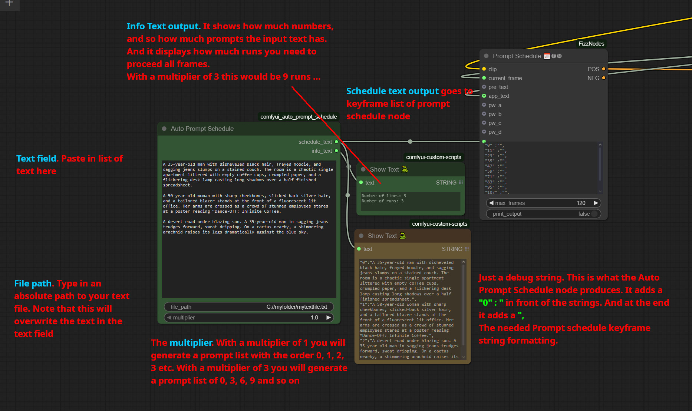
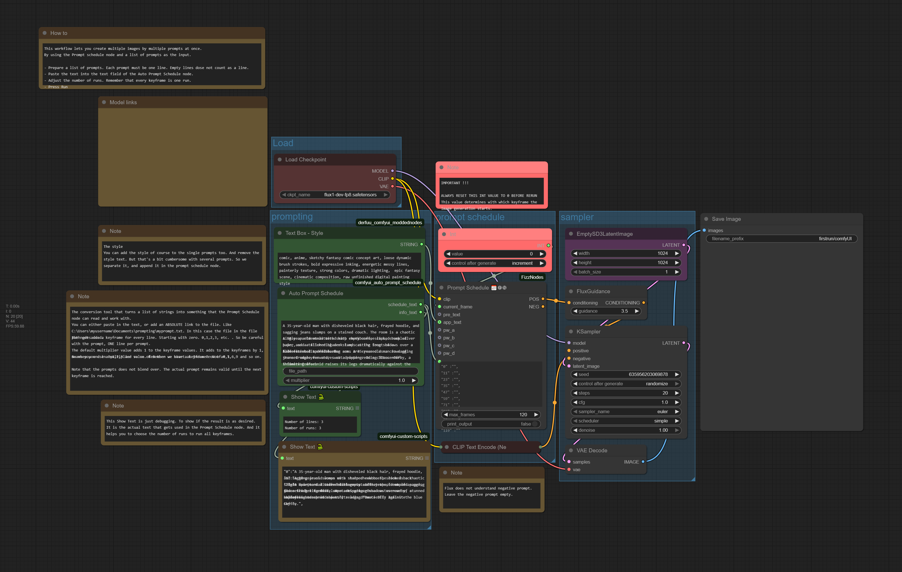

# Auto Prompt Schedule

Auto Prompt Schedule is a [ComfyUI](https://github.com/comfyanonymous/ComfyUI) helper node for the Prompt Schedule Node or the Batch Prompt Schedule node from Fizzledorf. You need this Prompt Schedule nodes to make use of the Auto Prompt Schedule Node.

https://github.com/FizzleDorf/ComfyUI_FizzNodes

https://github.com/FizzleDorf/ComfyUI_FizzNodes/wiki/Prompt-Schedules

Auto Prompt Schedule helps you to generate the list of keyframes. So that you don't have to type it manually all the time. All you need is a list of text where each line represents one prompt. And the node then converts this list to a list of keyframes that can directly be used in the Prompt Schedule node. For example to have a batch to run several prompts one after another, and generate images for it. The node contains an example workflow for exactly this needs. See Example workflows folder.

## Installation

To install Auto Prompt Schedule in addition to an existing installation of ComfyUI, you need to follow the following steps:

1. goto `ComfyUI/custom_nodes` dir in terminal(cmd). No witchcraft. Simply navigate to the folder in the windows explorer. Then in the explorer header type in cmd, and the terminal will open in this path.
2. Type `git clone https://github.com/ReinerBforartists/comfyui_auto_prompt_schedule`. Wait for the download to finish.
3. Restart ComfyUI

Note that the Auto prompt schedule node does NOT appear in the Comfy manager yet. You can find it in the Text category. Or by a double click and type in Auto Prompt.

## Usage

A picture says more than a thousand words.

## Example Workflow
The example workflow uses the Prompt Schedule Node from Fizzledorf. It is a batch workflow to generate multiple images from the list of prompts in one go. Paste in your prompt list, turn up the number of runs, press run.

